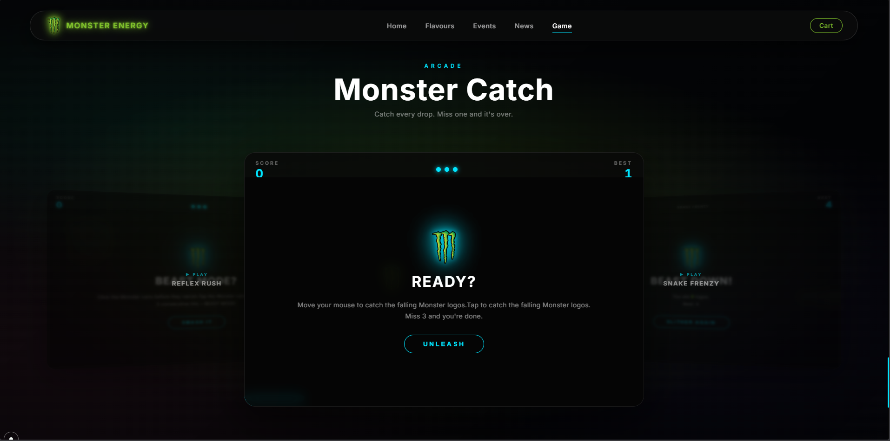

# Monster Energy Experience

**Live Demo: [monster.dinomae.in](https://monster.dinomae.in/)**

A passion project built to experiment with immersive web experiences. It's a high-energy, single-page site for Monster Energy that leans heavily into glassmorphism, GSAP animations, and a full 3-game arcade hub. The goal was to create a site that feels as "monstrous" as the brand itself — fast, dark, and visually intense.

---

## The Vibe

The site is designed to feel "alive" using GSAP ScrollTrigger to handle the scroll flow. As you scroll, the product stays central, morphing and reacting to your position. Everything — from custom cursor tracking to glowing liquid-crystal buttons — is built to keep the user engaged.

---

## Features

- **Dynamic Flavour Swapping:** Switch between Original, Blue, Purple, and Red. The whole site's theme (glows, accents, text shadows) shifts instantly to match the can.
- **3-Game Arcade Hub:** A 3D coverflow carousel housing three fully playable HTML5 Canvas games. Click or swipe to switch between them.
- **News & Events:** Custom-built glassmorphic modals with smooth transitions and a "More News" side panel.
- **Magnetic Navigation:** A sticky navbar that scroll-spies your position and enables smooth anchor scrolling.
- **Responsive Design:** Fully responsive — desktop, tablet, and phone. Swipe gestures on mobile, proper tap targets, and safe-area insets.
- **Custom Cursor:** Mouse-following dot + ring with hover morphing effects (hidden on touch devices).

---

## Arcade Hub — Games

The arcade section features a **3D coverflow carousel**. The active game sits front and center; the other two are visible as scaled, rotated previews behind it. Switch by clicking a preview card, swiping left/right on mobile, or using ← → arrow keys.

### 🟢 Monster Catch
Catch every falling Monster logo. Miss 3 and it's over.
- **Controls:** Move your mouse / drag your finger — the paddle follows.
- Difficulty ramps up as your score increases (faster drops, tighter spawning).
- Lives displayed as glowing HUD dots.

### 🐍 Snake Frenzy
Classic snake, Monster-branded. Eat logos to grow. Don't bite yourself or the walls.
- **Controls:** Arrow keys / WASD, touch-swipe, or just move your mouse — the snake steers toward the cursor automatically.
- Grid-based game loop with increasing speed.

### ⚡ Reflex Rush
Monster cans appear on a grid. Tap or click them before they vanish.
- **Controls:** Click or tap directly on the cans.
- 5 consecutive hits triggers **BEAST MODE** — faster spawns, shorter lifetimes.
- Touch events correctly map tap coordinates to the canvas grid.

---

## Screenshots




---

## Design Philosophy

Fundamentals kept deliberately simple: HTML, CSS, and Vanilla JavaScript — no heavy frameworks, no build steps. 3D renders were produced in Blender for the product imagery.

### Technology Stack

| Layer | Technology |
|---|---|
| Structure | HTML5 (semantic) |
| Styling | Vanilla CSS (modular) |
| Logic | Vanilla JS (ES modules) |
| Animation | GSAP + ScrollTrigger |
| Games | HTML5 Canvas API |
| 3D Assets | Blender renders |

---

## Project Structure

```
Monster/
├── index.html                      # Single-page entry point
├── README.md
│
├── assets/
│   └── images/                     # Cans, logo, backgrounds
│
├── css/
│   ├── main.css                    # Imports all modules
│   ├── base.css                    # Reset, tokens, navbar, loader, cursor
│   ├── variables.css               # CSS custom properties
│   ├── typography-nav.css          # Type scale & nav styles
│   ├── components.css              # Modals, cart, toast, overlays
│   ├── sections.css                # Game hub, events, news, hero rules
│   ├── responsive.css              # Breakpoints: 1024 / 768 / 480px
│   │
│   ├── components/
│   │   └── toast.css
│   │
│   └── sections/
│       ├── hero.css
│       ├── flavours.css / flavours-base.css
│       ├── game.css
│       ├── news.css / more-news.css
│       ├── events.css
│       └── footer.css
│
└── js/
    └── modules/
        ├── core.js                 # Scroll-spy, cursor, GSAP init, loader
        ├── game-hub.js             # 3D coverflow carousel controller
        ├── game.js                 # Monster Catch — canvas game
        ├── snake.js                # Snake Frenzy — canvas game
        ├── reflex.js               # Reflex Rush — canvas game
        ├── cart.js                 # Shopping cart drawer
        ├── flavours-modal.js       # Flavour modal + theme switching
        └── news-events.js          # News feed & events panel
```

---

## Key Implementation Details

### Arcade Carousel (`game-hub.js`)

All three game cards share the same center position in the DOM. GSAP drives `xPercent`, `rotateY`, `scale`, `z`, and `opacity` to create the 3D coverflow effect.

Switching is handled by a **capturing click listener** on the hub that compares the click coordinates against each preview card's `getBoundingClientRect()`. This bypasses CSS `pointer-events` entirely — necessary because the 3D-transformed bounding boxes physically overlap on screen.

A guard checks whether the click landed inside the **active card's game-container** first; if so, the event is passed through to the game (preventing accidental switches when playing Reflex Rush near the edges).

Mobile switching uses `touchstart`/`touchend` on the hub: a horizontal swipe with `|dx| > 50px` and `|dx| > |dy|` triggers `switchNext()` or `switchPrev()`.

### Snake Mouse Steering

Each game tick calls `steerByMouse()` before committing the direction. It computes the vector from the snake's head centre to the mouse position in canvas-space and selects the dominant axis (horizontal vs vertical) to set `nextDir`. A dead-zone of `0.6 × CELL_W` prevents jitter when the cursor is directly over the head. Keyboard and swipe inputs override mouse by writing to `nextDir` directly — last input before the tick wins.

### CSS Architecture

- `sections.css` contains 3D hub layout, pointer-event rules, HUD, overlay, and game card styles.
- `responsive.css` handles all breakpoints. Hub height, card width, and button tap targets all scale down progressively: `600px → 480px → 420px → 380px` (hub height) and `88vw → 90vw → 92vw` (card width).
- `pointer: coarse` media query hides the custom cursor and mouse-specific instructions on touch devices, showing touch instructions instead.

### Mobile Considerations

- `viewport-fit=cover` + `theme-color` meta for notch devices and Android Chrome address bar theming.
- Overlay buttons are `min-height: 48px` (WCAG 2.5.5 touch target size).
- `canvas { cursor: auto }` on `pointer: coarse` — no invisible cursor on phones.
- Reflex Rush touch events extract coordinates from `e.touches[0].clientX/Y` and pass a synthetic object to the shared `pointerDown` handler.

---

## How to Run

```bash
# Any static server works — e.g.:
npx http-server . -p 8080
# then open http://localhost:8080
```

Or just open `index.html` directly in a modern browser (Chrome, Firefox, Safari, Edge).

---

Unleash the Beast.
